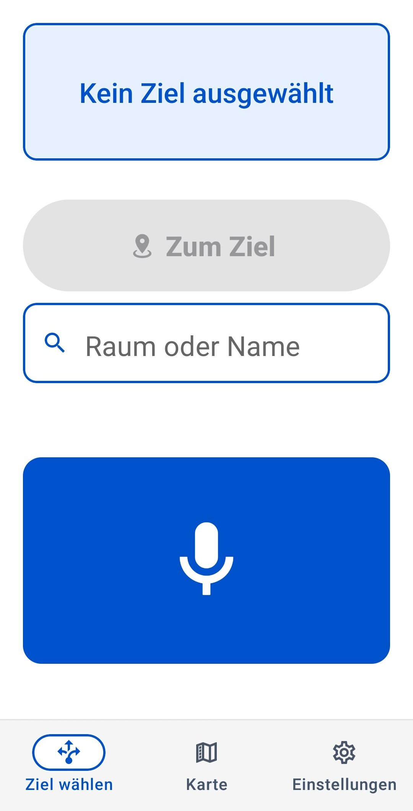
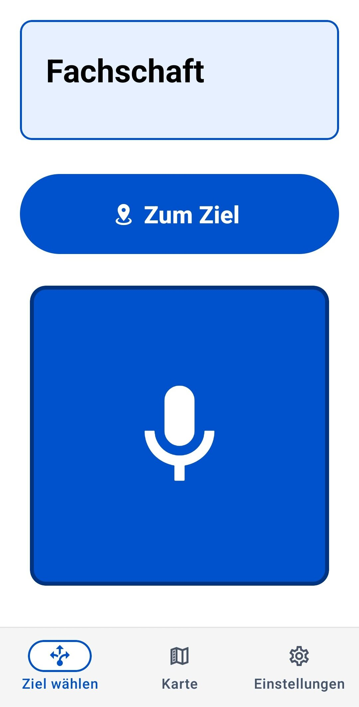
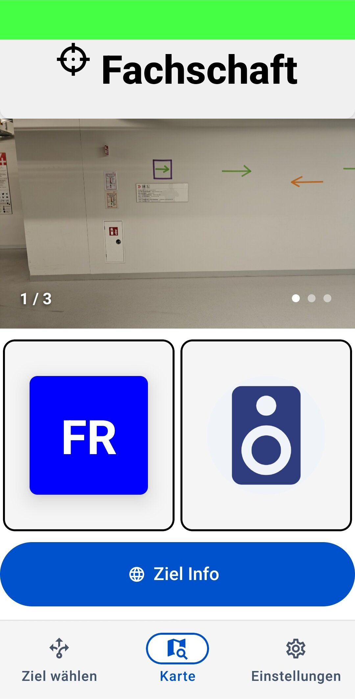

# HSD Indoor Navigation System
A comprehensive indoor navigation solution for Building 4 at Hochschule Düsseldorf, designed with accessibility as a core principle. The system provides barrier-free navigation through WLAN positioning, audio feedback, and intuitive interfaces.

## Screenshots
<details>
  <summary>📱 Navigation Client</summary>
  <p align="center">
    
    
    
    
    
  </p>
  <p align="center">
    
    
    
  </p>
</details>

<details>
  <summary>📱 WLAN Logger</summary>
  <p align="center">
    
    
    
  </p>
</details>

## System Architecture
This project consists of five main components:

### 1. Navigation Client (React Native)
Mobile application providing:
- WLAN-based indoor positioning
- Barrier-free navigation interface
- Audio descriptions for rooms and waypoints
- Support for visual and tactile navigation modes

### 2. Navigation Server (Hono.js REST API)
Backend services handling:
- Position determination using WLAN fingerprinting
- Route calculation and navigation guidance 
- Grid square mapping
- Integration with Context Server

### 3. Room Information Website (SvelteKit)
Web application providing:
- Room information and occupancy details
- Accessible interface for users
- Audio descriptions for each room
- Mobile-optimized views integrated into the navigation client

### 4. Admin Interface (HTML/JavaScript)
Tool for system configuration:
- Position simulation and testing
- Grid square visualization
- Route testing and validation

### 5. WLAN Logger (React Native)
Mobile application for creating the WLAN fingerprint dataset:
- Floor-based WLAN signal mapping
- Interactive position marking on floor plans
- Comprehensive network scanning features
- Data export and server synchronization

## Getting Started
1. Clone the repository with submodules:
```bash
git clone --recursive https://github.com/Blankjr/hsd-indoor-navigation.git
```

2. Follow setup instructions in each component's README:
    - Navigation Server Setup
    - Navigation Client Setup
    - Room Info Website Setup
    - Admin Interface Setup
    - WLAN Logger Setup

## Development
Each component can be developed independently, but for full system testing:
1. Start the navigation server
2. Launch the room info website
3. Run the navigation client
4. Use admin interface for testing if wlan fingerprinting mode deactivated
5. Use WLAN logger for fingerprint dataset creation

## Technology Stack
- Client: React Native, TypeScript, React Native Paper
- Server: Hono.js, Node.js, TypeScript
- Website: SvelteKit, TypeScript, TailwindCSS
- Admin UI: HTML, JavaScript, CSS
- WLAN Logger: React Native, TypeScript, React Native Paper

## Project Background
This system was developed as part of a Bachelor's thesis focusing on barrier-free indoor navigation. It combines WLAN positioning with accessible interfaces to provide navigation assistance for users with different needs.

## Acknowledgments

- Prof. Dr. Manfred Wojciechowski - Project Supervisor
- Dipl.-Ing. (FH) M.Sc. Patrick Pogscheba  - Second Examiner
- Faculty of Media, Hochschule Düsseldorf