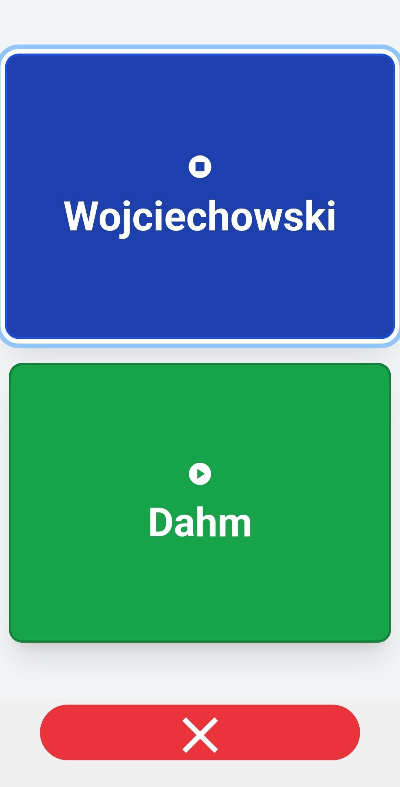
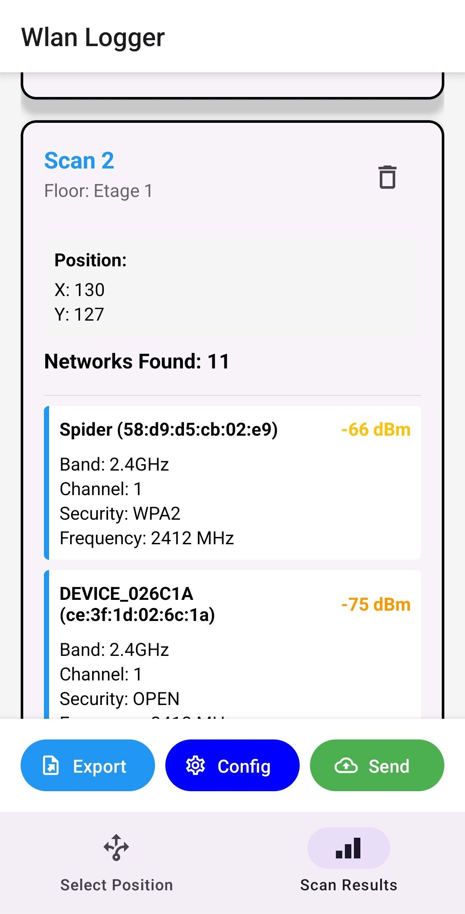

# HSD Indoor Navigation System
A comprehensive indoor navigation solution for Building 4 at Hochschule Düsseldorf, designed with accessibility as a core principle. The system provides barrier-free navigation through WLAN positioning, audio feedback, and intuitive interfaces.

## Screenshots
<details>
  <summary>📱 Navigation Client</summary>
  <table>
    <tr>
      <td align="center"></td>
      <td align="center"></td>
      <td align="center"></td>
    </tr>
    <tr>
      <td align="center"></td>
      <td align="center"></td>
      <td align="center"></td>
    </tr>
  </table>
</details>

<details>
  <summary>📱 WLAN Logger</summary>
  <table>
    <tr>
      <td align="center"></td>
      <td align="center"></td>
      <td align="center"></td>
    </tr>
  </table>
</details>

## System Architecture
This project consists of five main components:

### 1. Navigation Client (React Native)
Mobile application providing:
- WLAN-based indoor positioning
- Barrier-free navigation interface
- Audio descriptions for rooms and waypoints
- Support for visual and tactile navigation modes

### 2. Navigation Server (Hono.js REST API)
Backend services handling:
- Position determination using WLAN fingerprinting
- Route calculation and navigation guidance 
- Grid square mapping
- Integration with Context Server

### 3. Room Information Website (SvelteKit)
Web application providing:
- Room information and occupancy details
- Accessible interface for users
- Audio descriptions for each room
- Mobile-optimized views integrated into the navigation client

### 4. Admin Interface (HTML/JavaScript)
Tool for system configuration:
- Position simulation and testing
- Grid square visualization
- Route testing and validation

### 5. WLAN Logger (React Native)
Mobile application for creating the WLAN fingerprint dataset:
- Floor-based WLAN signal mapping
- Interactive position marking on floor plans
- Comprehensive network scanning features
- Data export and server synchronization

## Getting Started
1. Clone the repository with submodules:
```bash
git clone --recursive https://github.com/Blankjr/hsd-indoor-navigation.git
```

2. Follow setup instructions in each component's README:
    - Navigation Server Setup
    - Navigation Client Setup
    - Room Info Website Setup
    - Admin Interface Setup
    - WLAN Logger Setup

## Development
Each component can be developed independently, but for full system testing:
1. Start the navigation server
2. Launch the room info website
3. Run the navigation client
4. Use admin interface for testing if wlan fingerprinting mode deactivated
5. Use WLAN logger for fingerprint dataset creation

## Technology Stack
- Client: React Native, TypeScript, React Native Paper
- Server: Hono.js, Node.js, TypeScript
- Website: SvelteKit, TypeScript, TailwindCSS
- Admin UI: HTML, JavaScript, CSS
- WLAN Logger: React Native, TypeScript, React Native Paper

## Accessibility Implementation
### Audio Descriptions
Room and waypoint descriptions are generated using ElevenLabs' text-to-speech API with the `eleven_multilingual_v2` model, selected after extensive quality testing:

Tested Solutions:
- ElevenLabs: Selected for best overall audio quality and natural-sounding German speech
  - Model: eleven_multilingual_v2 
  - Optimized for multiple languages including German
- Amazon Polly: Good quality but less natural accentuation for German
- Google Cloud TTS: Decent quality but more robotic compared to ElevenLabs
- Mozilla TTS: Open-source alternative but less consistent quality
- Coqui TTS: Open-source solution with good potential but requiring more fine-tuning for German

Audio specifications:
- Format: MP3
- Bit Rate: 320kbps (high quality)
- Average Duration: ~30 seconds per description

## Library Selection Rationale
### React Native
Selected as the primary framework for mobile app development for:
- **Cross-Platform Development**: Enables simultaneous iOS/Android development, reducing costs through shared codebase
- **Native Performance**: Direct access to native UI components with optimized bridge architecture
- **Developer Ecosystem**: Large, active community with comprehensive documentation
- **Maintainability**: Modular architecture enabling easy maintenance and updates

### React Native Paper
Chosen as the UI component library for:
- **Material Design**: Complete implementation of Material Design specifications
- **Accessibility**: Native support for accessibility features, WCAG-compliant
- **Native Standard Alignment**: Follows platform-specific design patterns that users are familiar with
- **Simplicity Over Aesthetics**: Prioritizes understandable, functional interfaces over modern design trends
- **Ease of Implementation**: Simpler learning curve compared to styled-component based alternatives
- **Maintenance Considerations**: More accessible to future maintainers
- **Customization**: Flexible theming system with consistent styling API
- **Support**: Regular updates and active maintainer community

### React Native Tethering (WiFi Module)
Selected as the WiFi scanning solution because:
- **Up-to-date APIs**: Uses latest Android WiFi classes, unlike outdated alternatives
- **Comprehensive Scanning**: Enables scanning of all available WiFi networks, not just connected ones
- **TypeScript Support**: Fully typed module enhancing development experience
- **Modern Android Support**: Specifically built for Android 10 and above
- **Infrastructure Utilization**: Leverages existing WLAN infrastructure without additional hardware
- **Cost Efficiency**: No additional hardware investment required compared to BLE beacons
- **Maintenance Free**: No physical components requiring regular maintenance

### Hono.js
Selected as backend framework for:
- **Lightweight Architecture**: Minimal overhead with fast execution times
- **TypeScript Integration**: Native support enhancing developer experience
- **Modern API Design**: REST-compliant with flexible request handling
- **Performance**: Optimized HTTP processing with efficient caching

### SvelteKit
Chosen for the room information website due to:
- **Simplicity**: Lighter alternative to meta-frameworks like Next.js or Astro
- **Performance**: Efficient server-side rendering with minimal client-side JavaScript
- **File-based Routing**: Intuitive project structure and routing system
- **Full-stack Capabilities**: Built-in API routes and server-side logic

### Admin Interface (HTML/JavaScript)
Implemented as a standalone solution for:
- **Simplicity**: Basic HTML/JavaScript sufficient for single-purpose testing interface
- **Separation of Concerns**: Originally planned as REST API route, separated for cleaner architecture
- **Maintainability**: Easy to modify without impacting core navigation server
- **Independence**: Can be deployed and updated separately from main components

## Project Background
This system was developed as part of a Bachelor's thesis focusing on barrier-free indoor navigation. It combines WLAN positioning with accessible interfaces to provide navigation assistance for users with different needs.

## Acknowledgments

- Prof. Dr. Manfred Wojciechowski - Project Supervisor
- Dipl.-Ing. (FH) M.Sc. Patrick Pogscheba  - Second Examiner
- Faculty of Media, Hochschule Düsseldorf